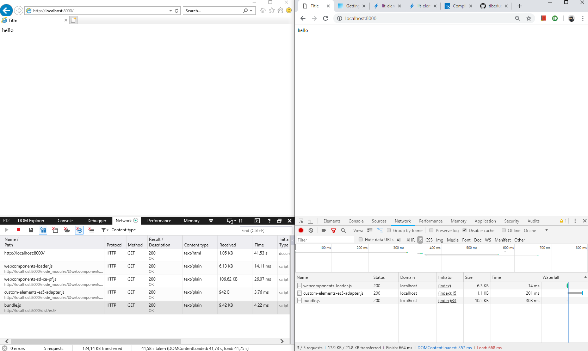

# Webpack-TypeScript-WebComponent

> This is sample repository adopts custom elements for ie11 and modern browsers




## Building the repo

```shell
npm run build
```

## Building only types

```shell
npm run build:types
```

## Type-Checking the repo

```shell
npm run type-check
```

And to run in --watch mode:

```shell
npm run type-check:watch
```

## Docker

Build it inside a container

## build

    docker build -t es-variants-build .

where `es-variants-build` is a name chosen by you. 

## run

cmd :

    docker run -v "%cd%/src:/src" es-variants-build

bash:
    
    docker run -v "$pwd/src:/src/src" rest-test

